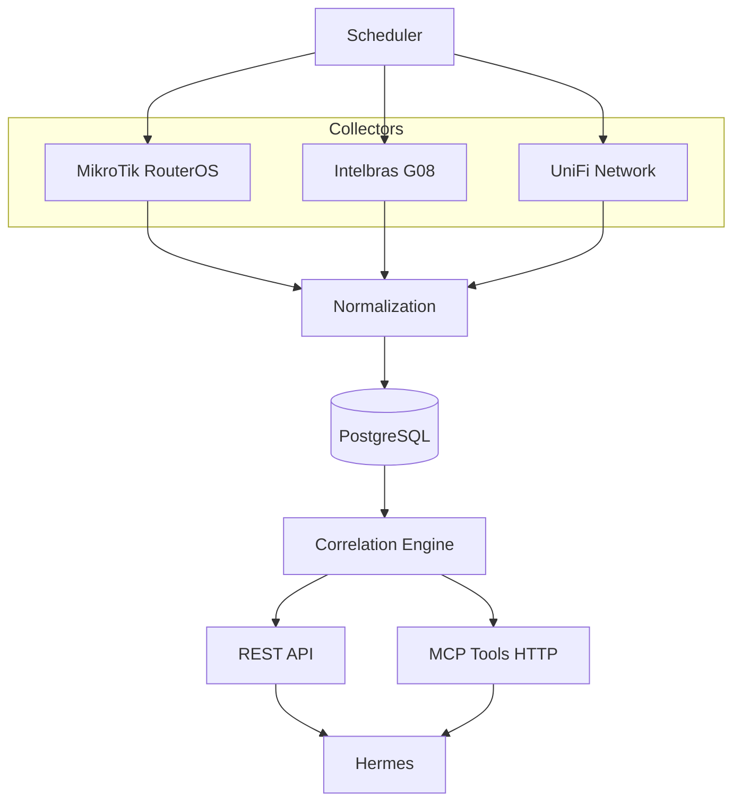

# Madalena Network Intelligence

Multi-tenant network inventory and correlation platform for **Madalena / Hermes** (3MS Tecnologia).

This is **not** a current-state-only inventory. Raw observations are kept so you can answer:

- where is this MAC now, and where was it before?
- which IPs did it use, on which device and interface?
- which observations (source + collection run) support that correlation?

Absence of a later observation is not treated as proof the device is gone.

## Skill vs Collector vs MCP

| Piece | Responsibility |
|-------|----------------|
| **Skill** (`hermes-3ms-skills`) | Teaches Hermes how to *operate* equipment |
| **Collector** (this repo) | Collects and normalizes data automatically (read-only) |
| **MCP** (`mcp_server`) | Lets Hermes *query* the structured inventory |

No circular dependency: skills may call this MCP later; this project does not embed skills.

## Architecture



Multi-tenant model: **Tenant → Site → Device → observations**. Every operational query requires `tenant`.

Product architecture: [`docs/architecture/overview.md`](docs/architecture/overview.md). Implementation snapshot: [`docs/architecture.md`](docs/architecture.md). Also: [`docs/collectors.md`](docs/collectors.md), [`docs/database-model.md`](docs/database-model.md), [`docs/runtime-configuration.md`](docs/runtime-configuration.md), [`docs/mcp.md`](docs/mcp.md).

## Requirements (host)

- Docker
- Docker Compose
- Git

No host Python, pip, Node, npm, or PostgreSQL installs.

## Quick start (lab)

Madalena VPS: [`docs/operations/madalena-deployment.md`](docs/operations/madalena-deployment.md).

```bash
cp .env.example .env
chmod +x scripts/bootstrap.sh scripts/validate-deployment.sh
SEED=true ./scripts/bootstrap.sh
./scripts/validate-deployment.sh
```

Makefile: `make test secret-scan test-persist`. Deploy helpers: `make bootstrap` / `make validate-deploy`.

## API endpoints

| Method | Path | Notes |
|--------|------|-------|
| GET | `/health` | Process up |
| GET | `/ready` | Database reachable |
| GET | `/tenants` | List tenants |
| GET | `/devices?tenant=&limit=&offset=` | Tenant-scoped |
| GET | `/devices/{id}?tenant=` | No credential/host refs |
| GET | `/macs?tenant=&limit=&offset=` | |
| GET | `/macs/{mac}?tenant=` | Correlated view + conflicts |
| GET | `/macs/{mac}/history?tenant=` | Timeline + provenance |
| GET | `/ips/{ip}?tenant=` | |
| GET | `/collection-runs?tenant=&limit=&offset=` | Completeness + command counts |
| GET | `/docs` | OpenAPI UI |

## MCP tools

HTTP base: `http://127.0.0.1:8081`

- `POST /tools/find_mac` — `{ "tenant", "mac" }`
- `POST /tools/find_ip`
- `POST /tools/get_device`
- `POST /tools/list_devices`
- `POST /tools/list_tenant_network_assets`
- `POST /tools/get_mac_history` — timeline with provenance
- `POST /tools/get_collection_status` — completeness + freshness
- `POST /tools/get_device_neighbors`
- `POST /tools/get_device_links`
- `POST /tools/get_topology`

`GET /tools` lists them. Tenant is always required.

## First lab tenant

Seed uses placeholder labels from `.env` (`SEED_TENANT_SLUG`, etc.). Example devices get Infisical-style `secret_prefix` references only — **no real customer credentials or IPs in this repository**.

Runtime secrets: inject `{PREFIX}_HOST`, `{PREFIX}_USERNAME`, `{PREFIX}_PASSWORD` in the private `.env` (gitignored). See [`docs/runtime-configuration.md`](docs/runtime-configuration.md).

## Collectors

- **MikroTik**: identity, interfaces, ARP, DHCP leases, bridge/FDB, neighbors. Parsers are transport-agnostic. Live path is generic SSH behind a read-only allowlist (`ReadOnlyTransport`). Tests use `MemoryTransport`.
- **UniFi Network**: Integration API GET (sites, devices, optional detail/uplink/ports). Live HTTP uses runtime `BASE_URL` + `API_KEY`. Tests use `MemoryUnifiClient`.
- **Intelbras G08**: ONT MAC table via `show ont mac-address-table interface gpon all` (read-only allowlist). Do not invent other G08 commands.

How to add a collector: [`docs/development/adding-a-collector.md`](docs/development/adding-a-collector.md). Specs: [`docs/collectors.md`](docs/collectors.md).

## Monitoring integrations

Reusable integrations live under `integrations/` (separate from collectors/API).

| Path | Description |
|------|-------------|
| [`integrations/zabbix/intelbras-g08/`](integrations/zabbix/intelbras-g08/) | Zabbix **7** SNMP template for Intelbras G08 |

SNMP communities, host IPs, and credentials stay in Zabbix/Infisical — never in this repository.

## Hermes integration (future)

Skills such as `mikrotik-routeros-ops` / `olt-intelbras-g08-ops` may call this MCP to locate MAC/IP/ONU context before operational changes. Do not embed this codebase inside the skills repo.

## Development standards

How this product is developed, tested, and evolved (not a copy of the global 3MS User Rule):

- Cursor Project Rules: [`.cursor/rules/`](.cursor/rules/)
- Documentation index: [`docs/README.md`](docs/README.md)
- Architecture: [`docs/architecture/overview.md`](docs/architecture/overview.md)
- Testing: [`docs/testing/strategy.md`](docs/testing/strategy.md)
- Local Docker ops: [`docs/operations/local-development.md`](docs/operations/local-development.md)
- Madalena deploy: [`docs/operations/madalena-deployment.md`](docs/operations/madalena-deployment.md)
- Agent map: [`AGENTS.md`](AGENTS.md)

## Security

Public repository rules: placeholders only, secret scan before push, no customer dumps. See [`SECURITY.md`](SECURITY.md).

License: MIT © 2026 3MS Tecnologia
