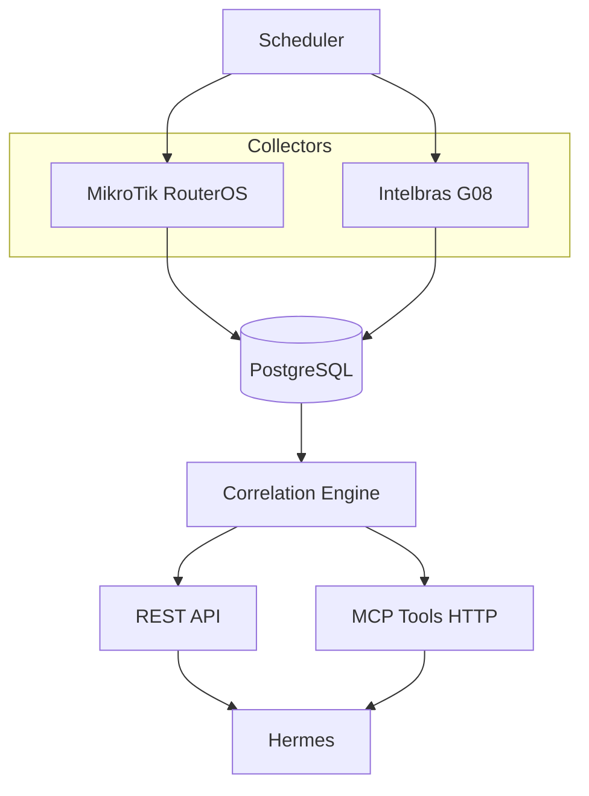

# Madalena Network Intelligence

Multi-tenant network inventory and correlation platform for **Madalena / Hermes** (3MS Tecnologia).

Answer questions like *"Where does MAC AA:BB:CC:DD:EE:FF come from?"* by correlating DHCP, ARP, bridge/FDB, and OLT/ONU observations — without destroying raw history.

## Skill vs Collector vs MCP

| Piece | Responsibility |
|-------|----------------|
| **Skill** (`hermes-3ms-skills`) | Teaches Hermes how to *operate* equipment |
| **Collector** (this repo) | Collects and normalizes data automatically |
| **MCP** (`mcp_server`) | Lets Hermes *query* the structured inventory |

No circular dependency: skills may call this MCP later; this project does not embed skills.

## Architecture



Multi-tenant model: **Tenant → Site → Device → observations**.

## Requirements (host)

- Docker
- Docker Compose
- Git

No host Python, pip, Node, npm, or PostgreSQL installs.

## Quick start

```bash
cp .env.example .env
docker compose config
docker compose build
docker compose up -d
docker compose run --rm migrate
docker compose run --rm api python -m scripts.seed_lab
docker compose run --rm --no-deps api pytest -q
curl -sf http://127.0.0.1:8000/health
curl -sf http://127.0.0.1:8081/health
```

Or via Makefile wrappers: `make build up migrate test seed secret-scan`.

## API endpoints

| Method | Path | Notes |
|--------|------|-------|
| GET | `/health` | Liveness |
| GET | `/tenants` | List tenants |
| GET | `/devices?tenant=` | Tenant-scoped |
| GET | `/devices/{id}?tenant=` | |
| GET | `/macs?tenant=` | |
| GET | `/macs/{mac}?tenant=` | Correlated view |
| GET | `/ips/{ip}?tenant=` | |
| GET | `/collection-runs?tenant=` | |
| GET | `/docs` | OpenAPI UI |

## MCP tools

HTTP base: `http://127.0.0.1:8081`

- `POST /tools/find_mac` — `{ "tenant", "mac" }`
- `POST /tools/find_ip`
- `POST /tools/get_device`
- `POST /tools/list_devices`
- `POST /tools/list_tenant_network_assets`
- `POST /tools/get_mac_history`
- `POST /tools/get_collection_status`

`GET /tools` lists them. Tenant is always required.

## First lab tenant

Seed uses placeholder labels from `.env` (`SEED_TENANT_SLUG`, etc.). Example devices get Infisical-style `secret_prefix` references only — **no real UNIPLAC credentials or IPs in this repository**.

## Collectors

- **MikroTik**: DHCP leases, ARP, bridge FDB parsers + collector scaffold (ROS7). Live SSH/REST transport TODO.
- **Intelbras G08**: ONT brief + MAC table parsers using commands documented in `olt-intelbras-g08-ops` skill. Live transport TODO; see `collectors/intelbras_g08/TODO.md`.

## Monitoring integrations

Reusable integrations live under `integrations/` (separate from collectors/API).

| Path | Description |
|------|-------------|
| [`integrations/zabbix/intelbras-g08/`](integrations/zabbix/intelbras-g08/) | Zabbix **7** SNMP template for Intelbras G08 |

SNMP communities, host IPs, and credentials stay in Zabbix/Infisical — never in this repository.

## Hermes integration (future)

Skills such as `mikrotik-routeros-ops` / `olt-intelbras-g08-ops` may call this MCP to locate MAC/IP/ONU context before operational changes. Do not embed this codebase inside the skills repo.

## Security

Public repository rules: placeholders only, secret scan before push, no customer dumps. See [`SECURITY.md`](SECURITY.md).

License: MIT © 2026 3MS Tecnologia
