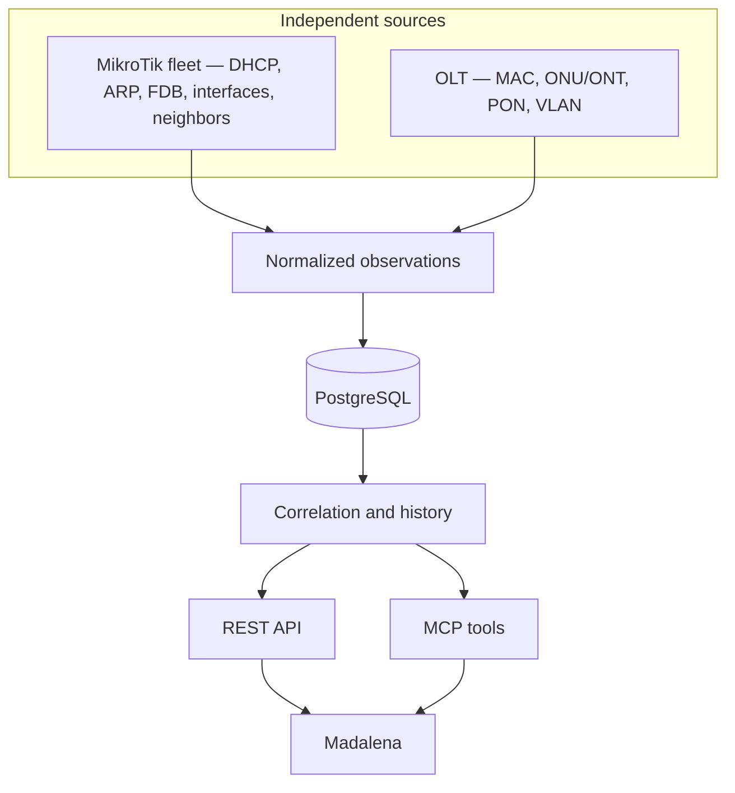
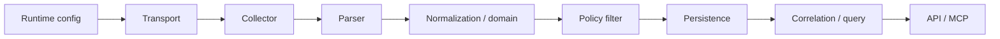

# Architecture overview

Canonical product architecture for Madalena Network Intelligence.

Current container names, scheduler intervals, and collection-run field names live in [architecture.md](../architecture.md) (implementation snapshot). Collector command lists live in [collectors.md](../collectors.md). This document states **how the product must be structured**, independent of a given PR.

## Purpose

Turn evidence from many network sources into queryable knowledge. The system does not assume where an endpoint is; it **discovers by evidence**.

Madalena/Hermes consume the API and MCP. Operational skills for changing equipment live in `hermes-3ms-skills`, not here.

## Evidence in, knowledge out



A tenant may have **several MikroTiks**. DHCP on one router, FDB on another, the same MAC on both — all are observations. The OLT is a separate source, not a child of a particular router.

## Layer boundaries



| Layer | Responsibility |
|-------|----------------|
| Runtime config | Secret **references** (`secret_provider`, `secret_prefix`). Host/user/password injected at process start. Never in Git. |
| Transport | Protocol I/O only. Returns raw text, timeout, auth failure. Read-only wrap + allowlist. |
| Collector | Orchestrates approved reads. Sets completeness. No query/API logic. |
| Parser | Text → structures. No network I/O. Known layouts only. Malformed input must not cause device mutation. |
| Domain | Canonical MAC (`AA:BB:CC:DD:EE:FF`), canonical IP, interface names, observation meaning, provenance. |
| Policy | Drop VLAN/CIDR/source/collector/interface matches **before** insert. Runtime table, no customer values in Git. |
| Persistence | Facts + time. Upsert matching keys; insert a new row when the key changes. Do not delete because a later run omitted a row. |
| Correlation / query | Join evidence. Expose conflicts. Shared by API and MCP. |
| API / MCP | Contracts. Tenant required. No second correlation engine. |

## Multi-tenancy

```
Tenant → Site → Device → observations
```

Every observation table carries `tenant_id`. The same MAC in two tenants is two identities. Query services take an explicit tenant slug.

## Temporal model

Observations are history, not a single “now” row that is overwritten into oblivion.

- Matching observation key → update `last_seen` (and related fields)
- Key change (MAC moved IP/interface/device) → **new** row; previous row kept
- Missing from a later run → **not** proof of removal, offline, or non-existence

Current view is **derived at query time** from latest timestamps. Historical evidence remains queryable.

Disappearance, if ever inferred, needs an explicit temporal policy and tests. See [ADR 0001](../decisions/0001-observation-history.md).

## Provenance

A correlated conclusion must name its evidence path: collector, device, collection run, timestamp (and location/interface when applicable).

`MAC → IP` and `MAC → ONU/PON` are incomplete without that path.

## Correlation

Primary mechanism: **evidence intersection**, not a handwritten “this MAC is on ONU X” table as source of truth.

Example: OLT MAC table ∩ DHCP MAC → IP + ONU + PON + VLAN (plus whatever else those observations carry).

Manual configuration may help; it must not mask contrary observations. Ambiguity is returned as `conflicts` (or equivalent), not collapsed. See [ADR 0002](../decisions/0002-tenant-isolation.md) and [concepts](../data-model/concepts.md).

## Runtime secrets

Database stores only provider + prefix. Collectors resolve `{PREFIX}_HOST`, `{PREFIX}_USERNAME`, `{PREFIX}_PASSWORD` (and optional ports) from the environment. Missing secrets → skip the run, do not crash, do not log values.

Do not persist customer management addresses in Git or in API/MCP responses.

## Out of scope without an explicit request

- Live collection against customer gear from CI or this public repository
- Write operations on MikroTik, OLT, or switches
- Embedding `hermes-3ms-skills` in this codebase
- Hardcoding a customer’s VLAN, DHCP router, or OLT identity
