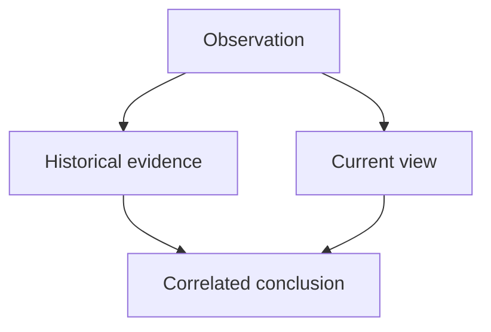

# Data model concepts

Table names, upsert keys, and indexes: [database-model.md](../database-model.md). This file is the **meaning** of the model.

## Core ideas

| Concept | Meaning |
|---------|---------|
| **Tenant** | Security and data boundary. Every observation belongs to one tenant. |
| **Site** | Optional grouping inside a tenant (building, campus). Not a second security boundary. |
| **Device / source** | An observed box (MikroTik, OLT, …) or logical source. Many devices per tenant. |
| **Observation** | A fact seen at a time from a collector/run: MAC on an interface, DHCP lease, OLT MAC row, neighbor, topology link, UniFi inventory node, … |
| **Endpoint / MAC** | Canonical identifier `AA:BB:CC:DD:EE:FF` scoped by tenant. |
| **IP evidence** | An IP seen with a MAC (DHCP, ARP, neighbor). Not “the” IP until correlation says so — and even then conflicts stay visible. |
| **OLT evidence** | MAC seen on a PON/ONU with distinct fields: ONT-ID, serial, GEM, VID, interface. |
| **Collection run** | One execution against one device: time window, completeness, counts, sanitized errors. |
| **Provenance** | Path from a conclusion back to collector, device, run, timestamp. |
| **Conflict** | Two or more plausible current observations that disagree (IPs, devices, locations). |
| **History** | Previous observation rows and `first_seen` / `last_seen` on each key. |

## Four different things

Do not treat these as the same row.

**Observation** — a stored fact: “device D, source S, run R, time T, MAC M on iface I with IP P”. It is not deleted because a later run did not repeat it.

**Current view** — query-time slice: observations whose timestamps share the latest moment for that identity. Used for “where is it now?”.

**Historical evidence** — the rest of the rows and the timeline. Used for “where was it?” and provenance.

**Correlated conclusion** — a join across sources (DHCP ∩ OLT MAC, topology MAC/source-id match, bilateral confirmation, etc.) plus any `conflicts`. Hostname/identity match alone is not a deterministic device identity. It is derived, not a substitute for raw observations. Without provenance it is incomplete.

## Identifiers

- MAC: one canonical string per tenant.
- IP: canonical textual form (IPv4 first-class; IPv6 accepted if normalized).
- ONT-ID ≠ serial ≠ GEM ≠ PON. Parsers and API fields must keep them separate.
- Device IDs are tenant-scoped in queries even when the UUID is globally unique.

## Absence

A MAC not listed in run N+1 is **unobserved in that run**. It is not automatically gone, offline, or never-real. Inferring disappearance is a future policy, not a side effect of ingest.

## Privacy

Out-of-scope VLANs/networks should be dropped **before** endpoint observations are written. The policy lives in private tenant configuration. See [ADR 0003](../decisions/0003-pre-persistence-exclusion.md).
